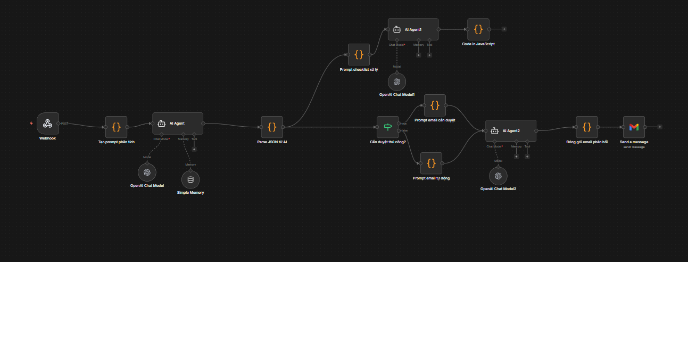

# AI_processTiket
# AI-Powered Multi-Step Ticket Processing Workflow (n8n)

Hệ thống tự động hóa xử lý ticket và phản hồi khách hàng đa bước bằng cách kết hợp sức mạnh của **n8n** và **AI Agents (OpenAI)**. Workflow này giúp phân loại, phân tích chuyên sâu, tạo checklist xử lý và tự động soạn thảo email phản hồi dựa trên mức độ phức tạp của từng ticket.

## 📌 Tổng quan tính năng

*   **Webhook Trigger:** Tiếp nhận dữ liệu ticket đầu vào theo thời gian thực.
*   **AI Phân tích Đầu vào (AI Agent 1):** Tự động phân tích nội dung ticket, trích xuất thông tin quan trọng và định dạng kết quả dưới dạng JSON nhờ bộ parse dữ liệu.
*   **Nhánh Xử lý Thông minh (Conditional Branching):**
    *   **Tự động hoàn toàn:** Nếu ticket đơn giản, hệ thống tự động soạn thảo email phản hồi chuẩn chỉnh.
    *   **Duyệt thủ công (Human-in-the-loop):** Nếu ticket phức tạp hoặc nhạy cảm, hệ thống sẽ chuyển hướng qua luồng cần duyệt trước khi gửi.
*   **Tạo Checklist Xử lý (AI Agent 2):** Song song với quá trình phản hồi, một AI Agent khác sẽ lập ra checklist các bước cần xử lý nội bộ để đảm bảo không sót việc.
*   **Tối ưu dữ liệu:** Sử dụng các đoạn mã JavaScript để chuẩn hóa và đóng gói email phản hồi trước khi gửi đi.

## 🛠 Lược đồ Workflow (Architecture)

Workflow được xây dựng trên n8n với kiến trúc các node như sau:

1.  **Webhook:** Nhận request chứa thông tin ticket.
2.  **Tạo prompt phân tích & AI Agent:** Phân tích ngữ cảnh, lưu ngữ nhớ ngắn hạn (`Simple Memory`).
3.  **Parse JSON từ AI:** Chuẩn hóa dữ liệu đầu ra của AI.
4.  **Cần duyệt thủ công? (Switch/IF Node):** Kiểm tra điều kiện rẽ nhánh.
5.  **Prompt email (Cần duyệt / Tự động):** AI Agent soạn thảo nội dung email tương ứng.
6.  **Prompt checklist xử lý & AI Agent 1:** Tạo danh sách công việc cần làm nội bộ.
7.  **Code in JavaScript:** Xử lý và tinh chỉnh dữ liệu thô.
8.  **Đóng gói email phản hồi:** Gom dữ liệu cuối cùng để chuyển tiếp đến các kênh gửi (Gmail, SendGrid, v.v.).

## 🚀 Hướng dẫn triển khai

### Điều kiện tiên quyết
*   Đã cài đặt **n8n** (bản Self-hosted hoặc n8n Cloud).
*   Tài khoản **OpenAI API Key** (hoặc nhà cung cấp LLM tương đương).

### Các bước thiết lập
1.  **Tải Workflow:** Sao chép file JSON của workflow này (hoặc export từ n8n của bạn).
2.  **Import vào n8n:** Tại giao diện n8n, chọn **Workflows** > **Import từ File** (hoặc dán sao chép từ Clipboard).
3.  **Cấu hình Credentials:**
    *   Kết nối node `OpenAI Chat Model` với API Key của bạn.
    *   Cấu hình Webhook URL phù hợp với hệ thống gửi ticket của bạn (CRM, Google Forms, HubSpot...).
4.  **Kích hoạt:** Chuyển trạng thái workflow từ `Inactive` sang `Active` (Published).

## 📄 Biến môi trường & Cấu hình AI

Để workflow hoạt động tối ưu, các AI Agents sử dụng:
*   **Model:** `gpt-4o` hoặc `gpt-3.5-turbo` tùy nhu cầu tối ưu chi phí.
*   **Memory:** `Simple Memory` giúp AI giữ ngữ cảnh trong suốt quá trình xử lý các bước liên tiếp của cùng một ticket.

## 📝 Giấy phép (License)
Dự án này được phân phối dưới giấy phép MIT. Bạn hoàn toàn có thể tùy biến và sử dụng cho mục đích cá nhân hoặc thương mại.
